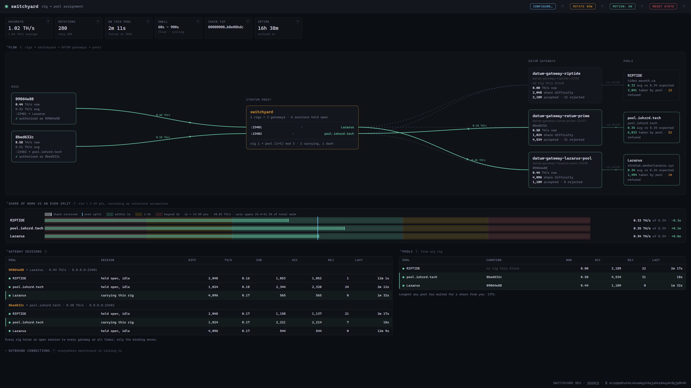

# switchyard

Split your hashrate across as many DATUM pools as you like, on the network's
own clock.

Fixed tracks, rolling stock, routed between them on a schedule.



*Two rigs, three pools, 280 rotations in. Each pool received 0.33, 0.35 and
0.34 TH/s against an even split of 0.34 — inside a third of a standard
deviation, which is the evenness the bands exist to prove.*

The pools above are real, run by people who did the work of standing up a
DATUM-compatible pool. Named here for attribution, but note that switchyard
neither knows nor cares which pools you use.

- **RIPTIDE** — <https://tides.maveth.ca>
- **RATUM Prime** — <https://pool.iohzrd.tech>
- **Lazarus Pool** — <https://pool.awokenlazarus.xyz>

**[The problem](#the-problem)** · **[How it works](#how-it-works)** ·
**[What it costs](#what-this-costs-you)** · **[What you need](#what-you-need)** ·
**[Gateway requirement](#one-requirement-on-your-gateways)** ·
**[Running it](#running-it)** · **[Configuring it](#configuring-it)** ·
**[Behaviour worth knowing](#behaviour-worth-knowing)** ·
**[Is it trustworthy?](#switchyard-is-a-man-in-the-middle)** ·
**[Is this hash-hopping?](#this-is-not-a-hash-hopping-tool)**

---

## The problem

A rig speaks stratum to one endpoint at a time, and an ASIC cannot split its
hashrate — one job, one coinbase, one pool. There is no fan-out.

What you *can* do is time-slice. Mine pool A for a while, then B, then C, and
over any horizon that matters you have contributed proportionally to each.
Expected earnings are unchanged; only variance moves.

```
rig1 ──▶ :23401 ─┐                  ┌─▶ gw-a :23336 ──▶ pool A
                 ├── switchyard ────┤   gw-b :23337 ──▶ pool B
rig2 ──▶ :23402 ─┘                  └─▶ gw-c :23338 ──▶ pool C
```

switchyard never talks to a pool. It sits between your rigs and your local
DATUM gateways, each holding its own permanent session with its Prime.
Rotating a rig disturbs no pool relationship.

Any number of rigs, any number of pools. With fewer rigs than pools, `P − R`
pools are dark at any moment — the arithmetic minimum. With more, pools carry
multiple rigs rather than one. Either way every rig tours every pool once per cycle,
so every pool's long-run share is equal.

---

## How it works

**One gateway per pool, one listener per rig.** A DATUM gateway's pool identity
is welded in at two levels: its config (`pool_host`, `pool_port`,
`pool_pubkey`) and the live state its Prime pushes down (payout scriptsig,
coinbase tag, prime ID, vardiff floor). Repointing one means restarting it,
which shows the pool a real disconnect.

**The schedule.** Rig `i` at step `t` is on pool `(base[i] + t) mod P`. Each
rig keeps a fixed offset, so rigs never converge; every rig visits every pool
exactly once per `P` steps. The opening arrangement is randomised but balanced,
so no pool is systematically favoured.

**The clock is new blocks**, detected from the `prevhash` in `mining.notify` on
the upstream sessions. This costs nothing — every gateway already pushes a
fresh job on every block, so there is no `blocknotify` wiring and no node
restart. Block intervals are exponential, so slots vary widely; that averages
out. `minDwellSeconds` only stops a burst of fast blocks from spending more
time reconnecting than hashing.

**The upstream mesh is always on.** Every rig holds a session to *every*
gateway permanently — a full `R × P` mesh — regardless of assignment. That is
the whole trick: DATUM keeps vardiff state on the stratum client object, tied
to the TCP connection and **not** keyed by worker name. A gateway dialled only
while a rig points at it would reset difficulty to the floor and re-climb on
every rotation. With the mesh held open, only the rig-facing connection cycles.

**The rig still has to reconnect.** `extranonce1` is assigned per-session at
`mining.subscribe`, folded into the coinbase and therefore the merkle root. A
share mined under one gateway's extranonce1 is a *different share* and cannot
be re-addressed — a proxy cannot remap it, the hash would be wrong. So a rig
session is bound to one gateway for its lifetime, and rotation means ending it.
`mining.set_extranonce` would avoid the drop but depends on firmware support
that varies.

---

## What this costs you

Rotating is not free, and the cost is hashrate.

A rotation ends the rig's session. From the moment the socket closes until the
miner's firmware has reconnected, resubscribed and taken a job, the hardware is
hashing nothing that counts. That gap belongs to the firmware; switchyard
cannot hurry it.

```
cost = reconnect gap / average dwell
```

A three-second reconnect is **0.5%** on ten-minute slots and **1.7%** on
three-minute slots. The gap is fixed; the slot is not. So the cost is set less
by your hardware than by how often you rotate — and rotation fires on blocks,
which you do not control. `minDwellSeconds` is the one lever you have.

Reconnect time varies by firmware — two seconds for some miners, ten for
others, and you cannot know yours from a datasheet. So switchyard measures it:
the **Rotation cost** card reports observed average and worst reconnect, and
the share of rig-time lost to them. Only gaps switchyard itself caused are
counted; gaps over a minute are excluded rather than averaged in.

**A second, smaller cost: your reject rate will rise slightly.** A rotation
changes the job and `extranonce1` under a running ASIC, so work already in the
pipeline is stale by the time it is submitted. In practice this is roughly one
share every couple of dozen rotations — enough to move a reject rate from
around 0.1% to a few tenths of a percent. Worth knowing only so the change
doesn't look like a fault.

**Is it worth it?** Expected earnings from splitting equal those from picking
one pool and staying, minus this cost. Meaning this will strictly cost you in
overall hash rate. That's not the point, though, the value of switchyard is in
its ability to support multiple pools to further decentralize the network.
If you feel that is worth more than roughly one percent of your hash rate, then
run switchyard.

---

## What you need

**One DATUM gateway per pool.** This is the biggest requirement, and it is more
infrastructure than switchyard itself.

A gateway's pool identity is fixed at startup, so one gateway cannot serve
multiple pools. You run one for each pool, permanently connected to it, and
switchyard moves rigs between them.

| You have        | You need                                             |
|-----------------|------------------------------------------------------|
| 3 pools, 2 rigs | 3 gateways, 1 switchyard, 2 listener ports           |
| 5 pools, 1 rig  | 5 gateways, 1 switchyard, 1 listener port            |
| 1 pool, 1 rig   | switchyard not needed — point the rig at the gateway |

Also **`pool_pass_full_users: false`** on every gateway. It is the DATUM
default, so usually nothing to do — but the failure when it is wrong is silent
and total. See [One requirement on your gateways](#one-requirement-on-your-gateways).

---

## One requirement on your gateways

Set **`pool_pass_full_users: false`** on every gateway. This is the DATUM
default.

With it false, the gateway pays its own configured `pool_address` and forwards
only the worker label — so the username switchyard passes through is just a
name, and switchyard needs nothing from you but a port.

With it **true**, the gateway forwards the whole username and the pool credits
whatever precedes the first dot, which means every username must be a payout
address for *that* pool. If you use a different address per pool, one miner
sending one username cannot satisfy all of them. If you use the same address
everywhere it would work — but it buys nothing, because with the flag false
each gateway already pays the address in its own config.

As a matter of policy, switchyard will not paper over this by editing
addresses on your behalf. It is your job to ensure the pool sees your proper
payout address.

**Switchyard cannot check this for you** — the setting lives behind the
gateway's admin password, and switchyard has no credentials and wants none.
What it can do is show you the consequences, those being rejected shares,
which is why a pool's status port is a required field.

**The failure is otherwise invisible.** Measured on a live gateway with
`pool_pass_full_users: true` and a worker name that is not an address:

```
Local Shares Accepted:  9      <- the gateway took every share
Local Shares Rejected:  0
Pool Shares Accepted:   0      <- the pool took none of them
Pool Shares Rejected:   9
Status:                 Connected and Ready
```

Every share lost. Switchyard reported 9 accepted, 0 rejected; the gateway
reported itself ready; the miner showed full hashrate. The only place the loss
appeared was the gateway's own status page — which is why switchyard reads it.
Setting the flag back to false restored acceptance on the first share.

---

## Running it

A single static binary, no dependencies.

### Docker

```yaml
services:
  switchyard:
    image: ghcr.io/insulince/switchyard:latest
    restart: unless-stopped
    volumes:
      - ./switchyard:/config          # the directory, not the file
    ports:
      - "7160:7160"                   # dashboard
      - "23401-23402:23401-23402"     # one per rig
    networks: [mining]                # must reach your gateways
```

Two things catch people:

- **Publish a port per rig.** Switchyard assigns from 23401 upwards; an
  unpublished port is a rig that cannot connect.
- **`127.0.0.1` inside a container means the container.** If your gateways are
  containers, share a network and use their names as the pool `host`. If they
  run on the host, use the host's LAN address.

Then open `http://<host>:7160/` and add pools and rigs from the setup screen.
No config file to write by hand.

### Binary

Download from [Releases](https://github.com/Insulince/switchyard/releases):

```
sha256sum -c SHA256SUMS --ignore-missing
chmod +x switchyard-linux-amd64
./switchyard-linux-amd64 -config config.json
```

A missing config is a fresh install, not an error — switchyard starts empty and
serves the setup screen.

### From source

**Go 1.26 or newer, and nothing else.** No third-party dependencies, so there
is no `go.sum` and no module download. No code generation, no build step for
the dashboard — `index.html` is pulled into the binary by `go:embed` at compile
time. There is no Makefile to read and no toolchain to install beyond Go.

```
git clone https://github.com/Insulince/switchyard
cd switchyard
go build -o switchyard .
./switchyard -config config.json
```

That is the whole process. What you get is one static binary with the
dashboard inside it; copy it anywhere and it runs.

**Installing it.** There is no installer and nothing to register — copy the
binary somewhere on your `PATH` and run it. Whatever you run it under, one
thing is easy to get wrong: the user it runs as needs **write** access to the
config *directory*, not just the config file, because saving from the dashboard
writes a new file and renames it over the old one.

**Working on it.** `just check` runs what CI runs — gofmt, a syntax check of
the embedded dashboard, `go vet`, and the tests under the race detector. The
dashboard has no build step, so editing `index.html` and rebuilding is the
entire front-end workflow. See [Contributing](#contributing).

---

## Configuring it

The dashboard writes `config.json` and the process rebuilds from it, so the UI
and hand-editing are equivalent. Unknown keys are rejected at startup, so a
typo fails loudly instead of being ignored.

```json
{
  "statusListen": ":7160",
  "pools": [
    { "name": "Pool A", "host": "gw-a", "port": 23336, "statusPort": 7154 }
  ],
  "rigs": [
    { "listen": "0.0.0.0:23401" }
  ]
}
```

| Field | Default | What it is |
|---|---|---|
| `statusListen` | `:7160` | Dashboard address. See the security note below before exposing it. |
| `pools[].name` | — | A label for the dashboard. |
| `pools[].host` | — | The gateway's address — container name, hostname or IP. |
| `pools[].port` | — | The gateway's **stratum** port (DATUM default `23334`). |
| `pools[].statusPort` | — | The gateway's **status page** port (DATUM default `7152`). Required — it is how switchyard shows what the pool actually accepted. |
| `rigs[].listen` | — | This rig's port. Assigned from 23401 up. |
| `minDwellSeconds` | `60` | Floor on a rotation slot, so fast blocks don't spend more time reconnecting than hashing. |
| `maxDwellSeconds` | `900` | Ceiling, so a slow block doesn't strand a pool. |
| `pollSeconds` | `2` | Dashboard refresh. |
| `gatewayPollSeconds` | `30` | How often gateway status pages are read. |
| `dialTimeoutSeconds` | `10` | Upstream connect timeout. |
| `versionRollingMask` | `""` (off) | Leave empty unless **every** rig uses version rolling — see below. |

### Where it lives

No search path: switchyard reads exactly the file you name with `-config`,
defaulting to `config.json` in the working directory.

| Running as | Put it at |
|---|---|
| Docker | `/config/config.json` (mount the **directory**) |
| By hand | `./config.json` |

- **Switchyard rewrites the file.** Hand-added comments won't survive a save
  from the dashboard.
- **It is the only way in.** Nothing changes the running system without going
  through `config.json`, so backing up that one file backs up your setup.
- **Mount the directory under Docker, not the file.** Saves are written to a
  temp file and renamed, which is what makes them atomic. A rename can't cross
  a bind-mounted *file*, so switchyard falls back to rewriting in place.

---

## Behaviour worth knowing

- **Worker names are forwarded, not rewritten.** Whatever your rig sends on
  `mining.authorize` reaches the gateway. There is no payout address in
  switchyard's config and no field that could mangle one.
- **Binding is deferred until `mining.subscribe`.** Miners open a second,
  silent TCP connection alongside the real one. Binding at accept time let that
  probe attach upstream and evict the hashing session — a rig that reconnected
  every three seconds and never hashed. A connection that never subscribes is
  not a miner.
- **A dead gateway does not idle a rig.** If the scheduled pool isn't ready the
  rig binds to any ready gateway and logs it. Earning on the wrong pool for one
  slot beats not earning.
- **The dark slot is real.** Pools that flag idle workers on share submission
  will see a gap on their dashboard; connection liveness doesn't help, because
  the discriminator is shares.

---

## Switchyard is a man in the middle

It has to be. It terminates the stratum session from your miner, opens its own
to your gateways, and relays between them. That is not a side effect of the
design — it *is* the design, and it is the same shape you would build to steal
someone's hashrate.

So the honest starting position: **switchyard cannot prove it is not hostile.**
Nothing in this position can. What it can do is make the claim cheap to check,
and keep the authoritative evidence somewhere it cannot reach.

A hostile proxy here could relay a different job (nothing in stratum binds a
template to its source), substitute the username the pool credits, or skim a
slice of shares elsewhere.

**Against that:**

- **It forwards your identity rather than rewriting it.** Configure your miner
  exactly as you would to reach the gateway directly. A rig entry needs only a
  port — no name field, no payout address. Where an override is set for an odd
  pool, the dashboard shows both the name your miner sent and the name that
  went upstream. A substitution nobody can see is indistinguishable from one
  nobody agreed to.
- **Every outbound connection is listed.** The dashboard's *Outbound
  connections* panel shows every socket switchyard holds to another machine.
  The complete set should be your gateways and nothing else. No telemetry, no
  update check, nothing resolving a hostname you didn't write down.

That panel is self-reported, so a hostile build could lie about it. Which is
why the next part matters.

### How to check, without reading the code

Ordered by how hard they are to fake. The last two cannot be faked at all.

**1. Ask the OS what is open.** Compare against the Outbound panel; they should
match exactly. The kernel is not asking switchyard what its sockets are.

```
ss -tp | grep switchyard          # Linux
netstat -ano | findstr <pid>      # Windows
lsof -i -P | grep switchyard      # macOS
```

**2. Make the hashrates agree in three places.** Your miner's reported rate,
switchyard's, and the sum of *Local Shares Accepted* on your gateways' status
pages. Skimming shows as a gap between what the hardware produced and what the
gateways received.

**3. Check the coinbase against the gateway's `/coinbaser` page.** DATUM builds
the template and publishes exactly what it built. If the job your rig was
handed didn't come from that gateway, it won't match. **Switchyard cannot alter
this page** — a different process serves it.

**4. Check your pool's dashboard.** Your worker, under your payout address,
doing the work you expect. This is authoritative precisely because it is
computed somewhere switchyard has no access to.

Checks 3 and 4 are the important ones: a hostile switchyard could substitute
values in passing, but **it cannot make DATUM or your pool cover for it
afterwards.** No version of this attack survives an operator who looks at their
own gateway and their own pool.

### The rest of the surface

- **The dashboard has no authentication and listens on every interface by
  default.** `statusListen` defaults to `:7160` because the common case is a
  container or headless box, where binding to `127.0.0.1` makes the page
  unreachable from the machine you are sitting at. The cost is that anyone who
  can reach the port can rewrite `config.json`. On an untrusted network, set
  `127.0.0.1:7160` and use an SSH tunnel, or put it behind an authenticating
  proxy.
- **Config is the only way in.** No path changes the running system without
  going through `config.json`. The UI is a convenience, never a requirement.
- **Builds are reproducible from this repo**, and the running version is in the
  footer and from `switchyard -version`.

---

## This is not a hash-hopping tool

Worth being explicit, since "a proxy that moves miners between pools" describes
both.

**What it is for:** pointing more pools at your hardware than your hardware can
point at itself. Most miners accept one primary pool and treat the rest as
failover. If you want three pools each getting a third of your hashrate,
something has to sit in front and divide it.

**What it deliberately does not do:** read pool difficulty, round state, queue
depth, or recent luck. It cannot — it never speaks to a pool. The only input to
the schedule is the chain producing a block, plus two dwell limits. There is no
signal available to it that hopping could be based on.

**On a TIDES pool it wouldn't be effective anyway.** TIDES pays on a share window
measured in accepted work, so a share's value doesn't depend on when in a round
it arrives. Classic pool-hopping targets **proportional** schemes, where early
shares in a round are worth more than late ones; that asymmetry is what makes
hopping profitable, and TIDES has none of it.

**The scheduling is deliberately unpredictable and even.** Rotations fire on
blocks nobody controls, and each rig visits every pool once per cycle. The
fairness band exists to *prove* that evenness, not to help you deviate from it.
A tool built for hopping would want the opposite: control over timing, and a
way to bias the split.

Weighting pools unevenly is a legitimate thing to want and switchyard doesn't
do it yet. It would not open a hopping vector either — the inputs would still
be the chain and a fixed ratio you chose, but this is not in active development
at this time.

---

## Versions and releases

The git tag is the only place a version is written down — no version file, no
constant, because two places to write it down is two places to disagree.

Tagged releases publish checksums, binaries for linux (amd64/arm64), macOS
(arm64) and Windows (amd64), and a multi-arch image to
`ghcr.io/insulince/switchyard`. A working-tree build honestly reports `dev`.

[SemVer](https://semver.org/). While the major version is `0`, the shape of
`config.json` may change between minor releases — switchyard will tell you at
startup if it no longer understands your file.

## Contributing

Issues and pull requests welcome. CI runs `gofmt`, `go vet` and
`go test -race`. There is a [justfile](justfile) with the same checks:

```
just            # list every recipe
just check      # gofmt, the embedded page, vet, race tests
just run        # build and run against ./config.json
just perf       # dashboard URL with the performance HUD enabled
```

`just` is [optional](https://github.com/casey/just) — every recipe is a plain command you can run yourself.

## Donations

If switchyard is useful to you, donations are accepted at: `bc1q8p0tut4cx4radkg3r6qja9szd4ay8v9pjp9hf0`
